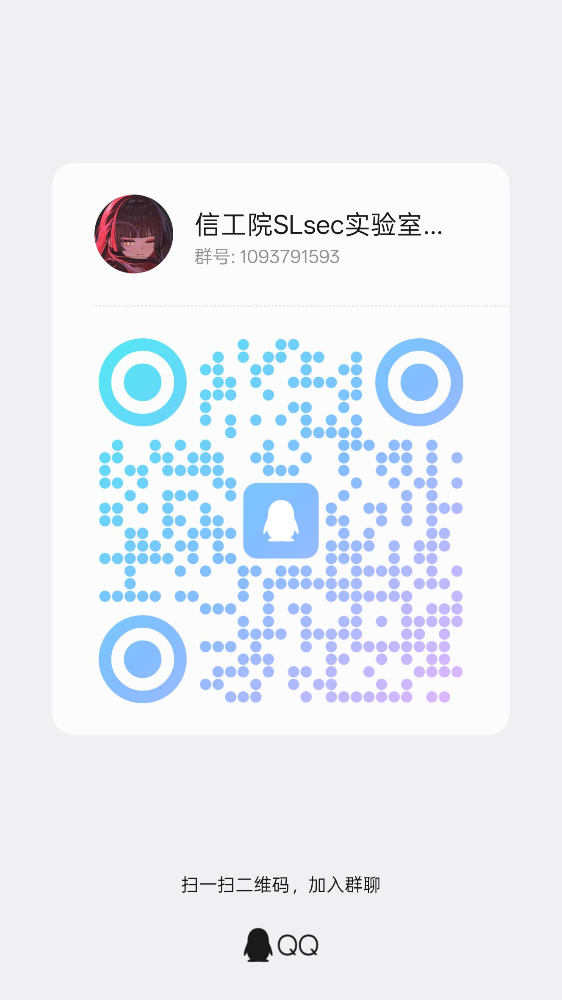

::: note
本文会随时间推移而调整。
:::

欢迎来到 **SLsec 实验室**——PDSU 校园网络安全力量的孵化器，一群热爱折腾、对底层技术充满好奇的极客们的聚集地。

如果你对“黑客技术”心怀向往，如果你享受解开一道难题时的狂喜，那么，我们找的就是你。

---

## 💡 我们是谁？

SLsec 不是一个单纯的“兴趣小组”或“授课班”。我们是一个以 **CTF（夺旗赛）** 为核心，以**实战攻防**和**安全研究**为导向的学生技术团队。

这里没有填鸭式教学，我们为你提供的是：

- **纯粹的技术氛围**：从 Web 漏洞挖掘到内核级 Pwn，从底层密码学数学原理到复杂的流量取证，总有人能与你探讨。
- **丰富的实战机会**：定期组织内部训练赛，组队出征全国各类主流竞赛（CISCN、强网杯等）。
- **传承的知识库**：每一份 Writeup、每一套出题笔记，都是历代师傅们踩坑后留下的宝贵财富。

---

## 🎯 实验室日常与文化

- **技术分享会（Tech-Share）**：不定期内部分享，可能是某道神仙赛题的破解，也可能是最新 0day 漏洞的复现。
- **以赛代练**：周末组队打线上 CTF，赛后开罐可乐复盘，乐在其中。
- **开源与分享**：我们推崇开源精神——你看的这套博客、我们的平台、所有工具链与我们出的题目，源码全部免费公开。希望你汲取营养，也期待你未来反哺社区。

---

## ⚔️ 赛道方向（总有一款适合你）

| 方向 | 简介 | 适合谁 |
|------|------|--------|
| 🌏 Web 安全 | SQL注入、文件上传、RCE等网站漏洞 | 入门首选，反馈直接 |
| 🔧 Pwn | 二进制漏洞利用（堆栈溢出、格式化字符串） | 喜欢底层、C语言功底扎实 |
| 🧑‍🔧 Reverse | 逆向工程，分析程序核心算法 | 热爱解谜、分析逻辑 |
| 🔑 Crypto | 密码学（RSA、AES、椭圆曲线） | 对数学敏感，团队稳健得分点 |
| 🤹 Misc & 🔎 OSINT | 隐写术、流量分析、开源情报 | 脑洞大、知识面广、入门简单 |

---

## 🚀 学习路线（三步上车）

0. **起步之前**
   - 先去阅读本站上[在第一步之前......](./before-begin)这篇文章，学习最基本的学习要领
   - 然后去阅读本站上[第一步......](./first-step)这篇文章，快速了解 CTF 几大方向，并获取入门资料

1. **夯实基础（1-2个月）**  
   - 参加实验室分享会，理清学习方向  
   - 装好虚拟机 + Kali Linux，学会 Linux 基本操作  
   - 掌握 Python 脚本编写

2. **刷题进阶（持续）**  
   - 初阶：[CTFHub](https://www.ctfhub.com/) 技能树  
   - 进阶：[攻防世界](https://adworld.xctf.org.cn/)  
   - 每道题写下 Writeup，能讲清楚才算真懂

3. **实战与选拔**  
   - 参与内部练习赛，体验真实竞赛氛围  
   - 通过选拔成为主力，公费出征省赛/国赛（路费住宿学校报销）

---

## 📌 如何加入？

如果你已经跃跃欲试，或者只是想来聊聊技术，随时欢迎！

1. **扫描下方二维码**，加入招新群（这是我们收集意向的第一步）。
2. **或者直接来实验室面基**：科技楼 **S605B**（推开门，你就是我们潜在的战友）。
 >到访之前请先**联系负责人**：QQ `2079169303`（先问一下是否开门）。

注意入群时，请认真填写所需要的信息：你的院系-专业-学号，便于我们辨认是否为机器人或者广告。

---

### 讨论与交流

如有任何疑问，欢迎通过 **QQ 群**联系学长，或直接来科技楼 S605B 面基！

> 一个小小的挑战：在我们博客的[第一步......](./first-step)文章中藏着一个 flag，找到它并提交到[这里](/first-ctf.html) 。这或许是你网络安全之路的第一个里程碑。

期待在数字世界的战场上，与你并肩作战！ 💻⚡