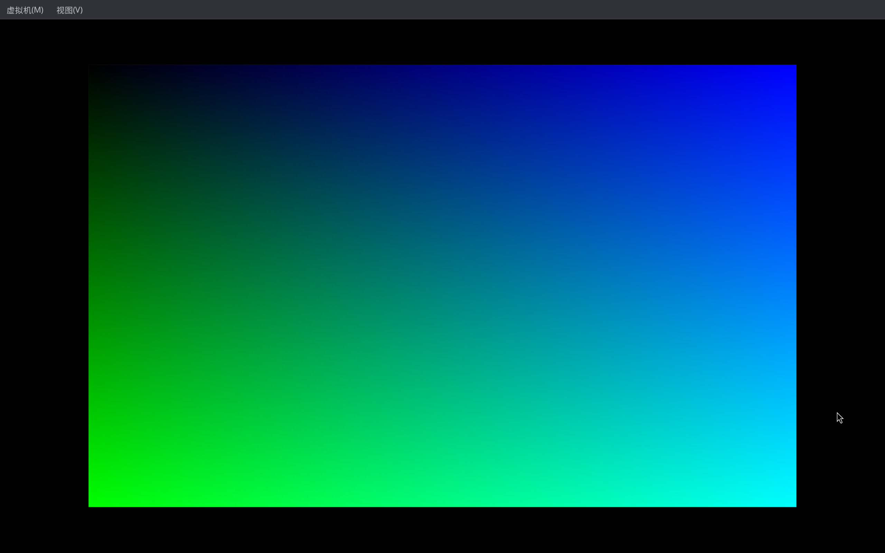

## 序

我们不再深入探讨繁琐的启动流程，而是用一种尽可能快的方式来构建好我们的内核bootloader，让我们能早些看到我们的内核跑起来。
<!-- more -->
## 准备

为了构造我们的kernel，我们需要准备一些必要的工具。目前我们需要的工具有：**gcc** **make** **git** **qemu**。期间如果需要其他工具，请自行安装，此处不再赘述。既然你选择阅读这份学习笔记，我们默认你拥有最基本的自行解决问题以及信息搜集与整合的能力。

由于笔者是Arch Linux环境，所以这里只讲述Arch Linux上这些工具的安装方式。其他环境请自行STFW，或者ATFA。

首先更新pacman本地数据库：
```bash
sudo pacman -Syu
```
等待更新完成后，然后安装前面提到的这些工具链。
```bash
sudo pacman -S gcc make git qemu-full
```
安装好后，找一个自己喜欢的位置，把limine的C框架拉到本地。
```bash
git clone https://codeberg.org/Limine/limine-c-template-x86-64.git
```

下拉完成后，进入limine工程目录。
```bash
cd limine-c-template-x86-64
```
然后make all进行编译测试。期间可能会下载别的内容，不要惊讶。
```bash
make all
```
之后make run用qemu运行。

不出意外的话，我们就会看到qemu窗口成功弹出，并且在过了一小会之后成功显示了一个彩色页面，这就说明我们下拉的limine框架工作正常，可以进行后续内核的编写了。



